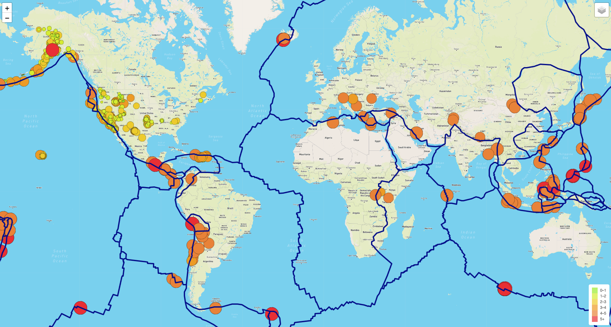
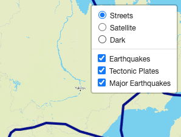

# Mapping Earthquakes
Mapping earthquake data with Mapbox, GeoJSON, D3, and Leaflet

## Overview

The purpose of this project was to utilize a variety of tools and resources to build a map of recent earthquakes.
- The background map was provided by Mapbox and OpenStreetMaps.
- The earthquake data was sourced from USGS Earthquake data.
- The retrieved data was manipulated with GeoJSON, Leaflet, and D3 JavaScript libraries.

## Usage

The map provies a few different view options though the overlay control panel in the top-right corner.
Map styles are as follows:
- Street Map
- Satellite Image w/ Street Data
- Dark map
The informational overlays available are:
- All Earthquakes (for the past 7 days)
- Techtonic Plate Boundaries
- The Major Earthquakes (for the past 7 days)